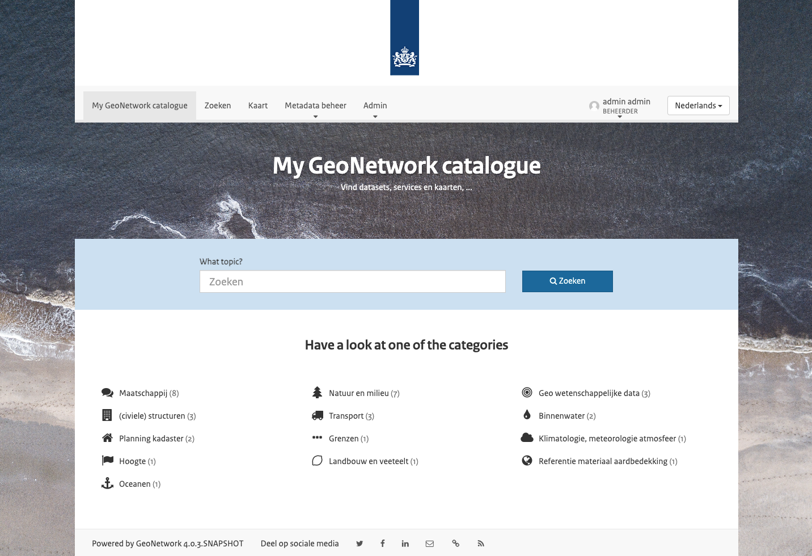
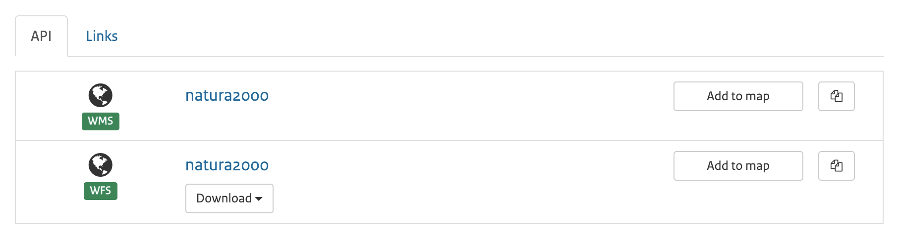

# A custom view for GeoNetwork 4.0.x: 'Dutch Government Skin'

This project contains a skin for the GeoNetwork Opensource project at https://github.com/geonetwork. A skin generally consists of a number of overrides for templates (html), styles (less) and scripts (js). The skin can be added to a GeoNetwork core sources as a git submodule or as a zipfile to a pre-build WAR.

Version 4.1 is rebuilt from the ground up. It's closely matched with the version 4.0.x of GeoNetwork OpenSource (Main branch).

This version replaces version 4.0.



## Features:
- Design slightly follows [dutch rijkshuisstijl](https://www.rijkshuisstijl.nl/)
- PDOK background layers as map backgrounds
- PDOK locationserver as gazetteer

This work has been started by PDOK and is further maintained by the GeoNetwork Usergroup Netherlands. If you find any issues, use the Github issue tracker here https://github.com/osgeonl/geonetwork-dutch-skin/issues.

A preconfigured skin is available as Docker image at https://hub.docker.com/r/geocat/geonetwork-nl/

The license of the project is GPLv2.

# Installation instructions

## If at build time (`mvn install`)

- Initialise the skin as a git submodule in `/web-ui/src/main/resources/catalog/views`

```bash
git submodule add -b 4.1.x https://github.com/osgeonl/geonetwork-dutch-skin.git web-ui/src/main/resources/catalog/views/dutch
git submodule init
```

## If at run time (WAR)

- Deploy the latest geonetwork `4.0.x` WAR from [Sourceforge](https://sourceforge.net/projects/geonetwork/files/GeoNetwork_opensource/)
- Grab a zip of https://github.com/osgeonl/geonetwork-dutch-skin/tree/4.1.x
- Unzip it in `/geonetwork/catalog/views/dutch`

## Settings

**Then** do some additional settings on the main project:

### General

- In `pom.xml`, configure the database type and connection details, `Language.default`, `Language.forcedefault`.
- Check https://github.com/metadata101/iso19139.nl.geografie.1.3.1 and https://github.com/metadata101/iso19139.nl.services.1.2.1 how to add dutch schema plugins
- On `Admin` > `Settings` and `Admin` > `Settings` > `User Interface` configure things such as catalog title, logo, URL, map extent, etc.
- Set the thesaurus used by the location-search (homepage), download file from https://www.nationaalgeoregister.nl/geonetwork/srv/eng/thesaurus.download?ref=external.place.administrativeAreas and upload it in `admin` > `classification` (from local file > place)

### Set custom search list items

In `Admin` > `Settings` > `User Interface` select the option to show the logo in the Header.

- Change the default template to `../../catalog/views/dutch/templates/list.html`

### Layout width

Change the width of the page to a fixed width:
- Go to  `Settings` > `User Interface` > `Top toolbar` > `Fluid container for Header and Top menu` and uncheck the option
- Go to  `Settings` > `User Interface` > `Home page` > `Fluid container for Home and Search` and uncheck the option

Do not change:
- Editor width: Go to  `Settings` > `User Interface` > `Editor application` > `Fluid container for the Editor` and make shure the option is checked

### Custom background layers for the Map

On `Admin` > `Settings` and `Admin` > `Settings` > `User Interface` set the default map to load to use the thematic map with pdok-backgrounds at `../../catalog/views/dutch/config-nl-viewer.xml`

### Tabbed interface for related elements

The content and layout of the related elements (links, downloads, etc) can be changed in the admin interface. In order to change it, go to `Admin` > `Settings` > `User Interface` > `Record View` and look for the distribution configuration,
this is a JSON file where default the "layout" is left `empty`, but when you enter `tabset`, tabs are being used. Like this: `"layout": "tabset",`



### How to add facets?

Go to `Admin` > `Settings` > `User Interface` > `Display filter tags in the search results` and select the option, and unselect the optiopn if you don't want the facets on the search results.

## Finally

- (re)start the service
- Verify the view by browsing to `catalog.search?view=dutch`. 
- If Ok, then alter the setting "view" to "dutch" in `Admin` > `Settings`

